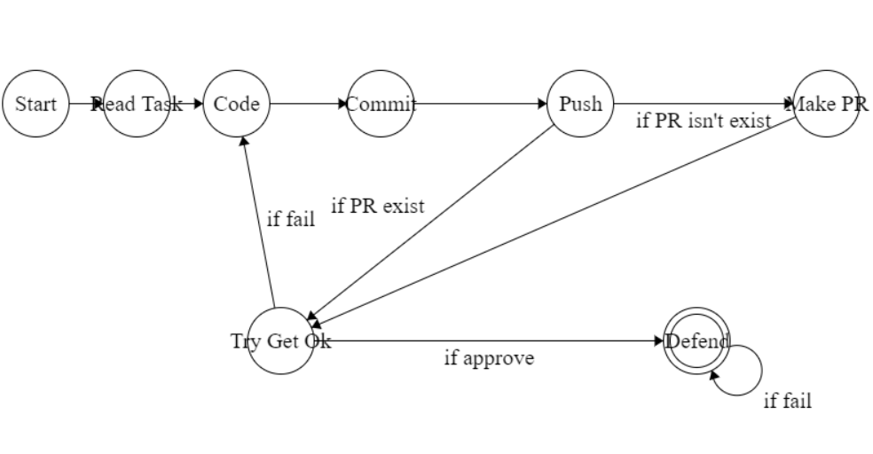

# Конечные автоматы и регулярные выражения

## Пререквизиты

- [Машина Тьюринга](../turing_machine/)

---

В этой задаче узнаем про математическую модель конечного автомата, а также про технологию на ней построенной - регулярные выражения.

> Мне больше нравится термин *Finite State Machine(FSM)*, ежели русский термин, поэтому ниже будет использоваться зарубежная терминология.

## Finite State Machine
Это абстракция, позволяющая описывать алгоритм. Представляет собой множества состояний, алфавит и переходы.

*Ничего не напоминает?*

Любой алгоритм можно представить в виде автомата. Если у Вас не появилось чувство дежавю, то поясню - похоже на машину Тьюринга. И не просто похоже - машина Тьюринга является автоматом, только более продвинутым: с бесконечной памятью(бесконечная лента) и универсальностью (на ней можно эмулировать любые вычисления).

## Практическое применение
Как следует из названия - на FSM строятся регулярные выражения, который позволяют искать в тексте по паттерну.   
Помимо этого FSM применяются в синтаксических анализаторах, применяемых в компиляторах.    
И даже в алгоритмах - например Ахо-Корасик, позволяющий искать в тексте множество паттернов.   

А ещё ею удобно описывать сложные системы. Ниже изображён FSM сдачи ваших задач:


## FSM на Си
Состояния удобно изображать в виде enum. Например, структура состояний для FSM выше будет выглядеть так:
```C
typedef enum{
    START,
    READ_TASK,
    CODE,
    COMMIT,
    PUSH,
    MAKE_PR,
    TRY_GET_OK,
    DEFEND
} State
```

- Прочитайте про [Enum](https://www.geeksforgeeks.org/enumeration-enum-c/), если плохо с ними знакомы.

Для переходов можно использовать условную логику. Так как условий довольно много, удобно использовать конструкцию switch case:
```C
State state = START;
switch(state){
    case START:
        // what are we going to do there?
        ...
        state = READ_TASK;
        break;
    case READ_TASK:
        ...
}
```

- Освежите знания про [Switch](https://www.geeksforgeeks.org/c-switch-statement/). 

**Постарайтесь называть свои состояния осмысленными словами, из которых станет понятно, что в них выполняется.**

## Регулярные выражения

Мы уже использовали регулярные выражения в рамках задач на утилиты Linux. Такой же инструмент есть в Си(и в большинстве языков программирования). 

Нам поможет библиотека ```regex.h```.
- Прочитайте про использование [regex](https://www.scaler.com/topics/c-regex/) в Си.

*Обратите внимание, что семантика шаблонов отличается от Linuxовских регулярок*

Также заметьте, что знакомая нам ```scanf()``` умеет принимать регулярки, фильтруя то, что поступает на вход.

## Задание

Вам необходимо решить задачу вашего варианта через FSM и регулярки. Свой вариант можно найти [тут](variants.md).

## Важные требования к решению
Чтобы получить максимальный балл за задачу, необходимо удовлетворять следующим критериям:
- Решить задачу обоими методами.
- Код должен быть понятным, названия переменных отражают то, что они хранят.
- Нарисуйте диаграмму своего FSM. Удобно это сделать [тут](https://madebyevan.com/fsm/).

Не выполнение любого из этих условий может служить поводом для снижения итогового балла. Или не может, если Вы умеете грамотно защищать свою точку зрения :=)

## Задача на подумать

Зная, как реализуется FSM и понимая, что машина Тьюринга - FSM: сможете реализовать машину Тьюринга на Си?


