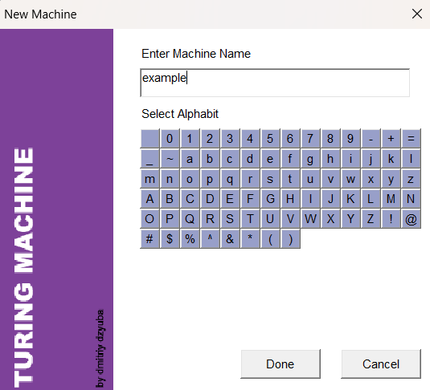
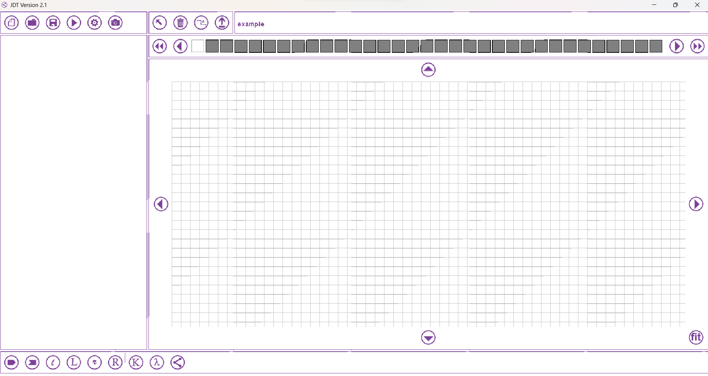

# Диаграммы Тьюринга

## Пререквизиты

- [Машина Тьюринга](../turing_machine/)

---

В этой задаче продолжаем развивать нейроны в голове и программировать машину Тьюринга, но уже в другой форме. Для выполнения этого задания необходимо скачать эмулятор, например, [этот](https://drive.google.com/file/d/1Q8ahirhCRc2JBpJE6X8S2cTmrvEO-PNs/view?usp=drive_link). Для работы этого эмулятора требуется установленная JVM. Скачать и установить нужно на [официальном сайте](https://www.java.com/ru/)

## Диаграммы Тьюринга

При описании программ на машине Тьюринга намного удобнее оперировать диаграммами. Преимуществ немало, из очевидных - наглядность, из-за которой проще отлавливать баги и показывать алгоритм другому программисту.

## Про диаграммер

Использовать конкретно этот необязательно, однако он является базовым. Речь будет идти про версию 2.2.

### Первое правило диаграммера - не нажимайте крестик в правом верхнем углу.

Оно закроет программу без предупреждения - можете потерять все свои наработки.

> Извините, программа написана давно и не нами. Если интересно, можете ревёрснуть исполняемый файл и поправить программу.

После запуска Java-приложения, вы встретите такое окно:
 
Слева направо:

- Создать новый файл
- Загрузить существующий файл
- Сохранить файл
- Запустить код
- Изменить рабочий алфавит
- Сделать скриншот

Нас интересует первая кнопка. Нажимаем на неё:
 

Вводим название программы и выбираем алфавит, которым будет оперировать машина.

Нас перебрасывает на главное окно:
 

Перейдём в нижнию панель.
  
Тут у нас расположены символы, которые обозначают действия. Именно ими придётся оперировать. 
Слева направо:
- Точка старта программы.
- Точка конца программы.
- Сдвиг влево на одну ячейку.
- Сдвиг влево на одно слово. 
> Словом считается любая последовательность символов до встречи пробела.
- Сдвиг вправо на одну ячейку.
- Сдвиг вправо на одно слово. 
- Скопировать слово
> Перед использованием этого символа, протестируйте его: посмотрите, откуда он ожидает, что вы его вызовите и посмотрите, куда он вас приведёт.
- Заменить текущий символ на другой
> Тут Вам в специальном окне предложат выбрать символ, на который заменить текущий.

Теперь поднимемся выше и взглянем на панель:
 

Тут нас встречает привычная нам лента. Чтобы ввести значение, нажмите на ячейку и напишите значение, которое хотите видеть в этой ячейке. Кнопка _стрелочка_ перемещает всю запись на одну ячейку влево/вправо. Кнопка _двойная стрелочка_ перемещает ваше слово на начало ленты и на конец соответственно. 

Разберёмся с иконками выше: 
 
Слева направо:
- Выбрать элемент. По умолчанию Вы не можете тыкать на элементы, только смотреть на них (READ-ONLY)
- Удалить элемент.
- Провести стрелку от одного элемента к другому.
- Загрузить машину.

Последнее требует пояснений. Машину стоит расценивать как функцию в обычном языке программирования. Например, мы можем в отдельной машине написать инкремент числа, а в основной, организовав цикл, вызывать эту машину столько раз, сколько нам нужно. 

## Декомпозировать - это круто.

Не пишите огромные функции/машины - это трудно читать. Функция по определению - это действие. Постарайтесь сделать так, чтобы действие было одно. Если ваша функция/машина делает несколько вещей (Умножает и складывает, делит и проверяет на делимость), то это повод разбить машину на несколько подмашин.

## Продолжаем наш разговор

Особо выделю следующий момент:
 

Когда Вы соединили два компонента, нужно выбрать символы, по которым будут происходить переходы по этой стрелке. По умолчанию переход происходит по всем символам. Если Вам нужно ограничить это - нажимаете на стрелочку сверху, нажимаете на интересующий переход и слева выпадает окно, в котором можно убрать символ, по которому будет произведён переход. Т.е. если Вы нажимаете на символ, переход по нему НЕ БУДЕТ произведён.

> Из условия детерминированности требуется, чтобы для текущего состояния был определён переход для каждого символа алфавита. Иначе Вы получите ошибку.

Для примера предлагаю Вам ознакомиться с наивным бинарным сложением двух чисел. [Тут](https://drive.google.com/file/d/1fAqPdwa1gDU0pEEZgNbtXoWW_R-Dae1E/view?usp=drive_link) есть файлик, откройте и поройтесь в нём, разберитесь, как он работает.

## Вопросы
- Почему я назвал этот метод "наивным"? Оцените от чего зависит время работы программы.
- Как можно решить эту задачу эффективнее?

> Примечание: Вам в задачах запрещается реализовывать сложение/вычитание так, как представлено выше в файле.

## Задание

Вам необходимо решить задачу вашего варианта. Свой вариант можно найти [тут](variants.md).

Приложите решение (сохранённую машину) в папку своего варианта.
